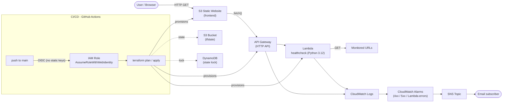

# Portfolio Health-Check Service

Serverless URL health-checker on AWS: an API Gateway-fronted Lambda function that pings a
configurable list of endpoints, backed by CloudWatch alarms/SNS notifications and a static
S3-hosted frontend — all provisioned with Terraform and deployed via a secure, keyless
GitHub Actions CI/CD pipeline.

## Architecture



## Key Technical Highlights

- **Remote state locking** — Terraform state stored in a versioned/encrypted S3 bucket with
  a DynamoDB table for state locking, preventing concurrent-apply corruption ([terraform/backend.tf](terraform/backend.tf)).
- **Secure CI/CD auth via AWS OIDC** — GitHub Actions assumes a scoped IAM role through
  `AssumeRoleWithWebIdentity`; no long-lived AWS access keys are stored in the repo or in
  GitHub Secrets ([terraform/github_oidc.tf](terraform/github_oidc.tf), [.github/workflows/deploy.yml](.github/workflows/deploy.yml)).
- **Modular Terraform code** — resources split by concern (`main.tf`, `lambda.tf`,
  `frontend.tf`, `cloudwatch.tf`, `github_oidc.tf`, `backend.tf`) and fully parameterized via
  [terraform/variables.tf](terraform/variables.tf) (region, environment, alarm email, GitHub repo/branch, etc.).
- **Automated linting & security scanning** — every PR runs `terraform fmt`, `terraform validate`,
  `tflint`, and `tfsec`, plus the Python test suite, via [.github/workflows/pr-checks.yml](.github/workflows/pr-checks.yml).
- **Observability built in** — CloudWatch alarms for Lambda errors and API Gateway 4xx/5xx
  rates, with optional email alerting through SNS.

## Local Setup

### Run the Python tests

```bash
cd app
pip install -r requirements-dev.txt
pytest
```

### Stand up the environment from scratch (3 commands)

```bash
cd terraform
terraform init
terraform plan -out=tfplan
terraform apply "tfplan"
```

> First-time bootstrap note: the S3/DynamoDB state backend is created by this same
> `apply`. See the comment in [terraform/backend.tf](terraform/backend.tf) for the local-state → S3-state
> migration step if starting from zero.
